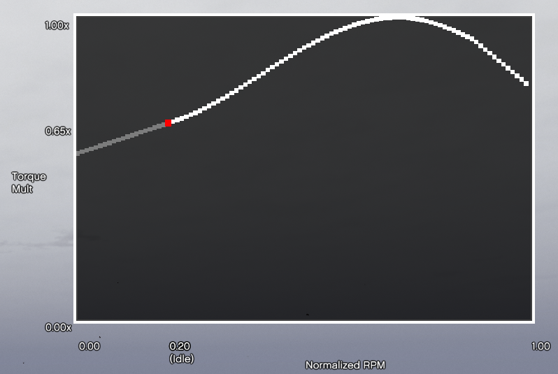
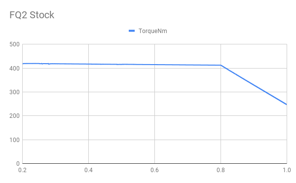
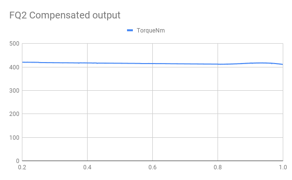
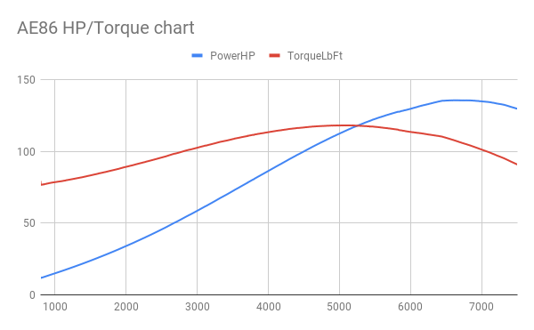

# Custom Torque Map

Custom Torque Map is a GTA V script that changes the engine torque output.



(Engine mapping as visualized in-game by the script)

## Requirements and installation

* Grand Theft Auto V
* [ScriptHookV](http://www.dev-c.com/gtav/scripthookv/)

To install, drag and drop the `CustomTorqueMap.asi` file and `CustomTorqueMap` folder to the GTA V folder.

Engine mappings go into the `Configs` folder, and are automatically loaded when the model matches,
or the model **and** plate match.

Open the management menu with the `ctm` cheat (use tilde (`~`) to open the cheat console).
Other hotkeys may be assigned in `settings_menu.ini`.

## Background

By default, the engine output in GTA V is linear, and drops with 40% towards the end of the rev range (80%).
This causes every vehicle to feel similar during acceleration, even with varying amounts of `fInitialDriveForce` and
`fInitialDragCoeff` in the handling definitions. The following figure shows the power output at the wheels. The vehicle
is an FQ2, and the power output is obtained from one of the fields from the wheel data:



(Note: N⋅m number is obtained from `fInitialDriveForce * fMass`)

This script overlays an engine map on the base input power - the engine torque map can be defined as anything, and has
real in-world performance changes. The original power drop is compensated for initially, after which the torque
adjustment map is overlaid.

The straightened base torque output looks like this:



From this linearized output, any arbitrary normalized map of torque-rpm output can be applied.

## Configuration files

Configuration files are to be placed in the `Configs` folder. These are the things to pay attention to:

File name: Anything goes, as long as it ends on `.ini`.
The file name without the extension is used as "Name" in the script.

`handling.meta`:

* `fMass` is used to calculate torque (N⋅m or lb⋅ft).
* `fInitialDriveForce` is the base value of the map, the final output is multiplied with this base value.

Tuning: Vehicle mods, such as engine upgrades and turbo, will impact performance final output.

```ini
[ID]
; Model name of vehicles this configuration applies for.
ModelName = r32

; Optional: Hash of model name.
; Only used if specified, may be omitted entirely.
ModelHash = 0x8C34D838

; Optional: License plate this configuration applies for.
; If both model and plate match, the plate variant of the configuration is prioritized.
; Only used if specified, may be omitted entirely.
Plate = 46EEK572

[Data]
; IdleRPM and RevLimitRPM are optional. These values are used to calculate horsepower and actual RPM.

; RPM the engine idles at.
; Corresponds to 0.2 normalized RPM.
IdleRPM = 800

; RPM of the rev limiter.
; Corresponds to 1.0 normalized RPM.
RevLimitRPM = 8000

; Torque map. Do not touch the END_OF_MAP lines, these are used to determine the begin and end of the map.
; The map is defined as {normalized_rpm}|{normalized_torque}.
; At least three data points are required. There is no upper limit.
; normalized_rpm: RPM as ratio between idle and rev limit.
;                 0.2 RPM is idle, 1.0 RPM is rev limit.
;                 Use "NormalizedRPM = (RPM - IdleRPM) * (1.0 - 0.2) / (RevLimitRPM - IdleRPM) + 0.2"
;                 to map from real RPM to normalized RPM.
; normalized_torque: Torque as ratio of max torque.
;                 Use "NormalizedTorque = Torque / MaxTorque"
;                 to map from real torque to normalized torque.
TorqueMultMap = <<<END_OF_MAP
0.222|0.612
0.278|0.718
0.333|0.776
0.444|0.898
0.556|0.939
0.667|0.980
0.689|1.000
0.778|0.955
0.867|0.918
0.911|0.816
END_OF_MAP
```

For more pre-made configs, check [TheAdmiester's repository on GitHub](https://github.com/AJB-Tech/GTATorqueMaps).

## Power figures, and other assumptions

Since `fInitialDriveForce` most likely is defined as `TorqueNm / Mass`, it's possible to get the (probably)
original torque number, by multiplying `fInitialDriveForce` and `fMass`. Thus, the real-unit values generated
by this script depend on an accurate `fInitialDriveForce` and `fMass`.

The game lacks any definition of real engine speed, and it cannot be deduced from gearing data alone.
Power figures (horsepower and kilowatts) thus rely on the `IdleRPM` and `RevLimitRPM` being defined in the
configuration files.

Numbers displayed in-game are measured at the wheel. These numbers are affected by throttle input, terrain,
engine mod level and the presence of the turbo mod. Additionally, scripts that alter power also affect this
final torque.

## Data logging

The script includes a function to record the actual torque and power output. The format is `{timestamp}-{model}.csv`,
and any software such as Microsoft Excel or Google Sheets can be used to import this file to process the output.
An example of visualized data is this following graph:



Columns:

* NormalizedRPM: RPM between idle (0.2) and max (1.0)
* RealRPM: "Real" RPM, from NormalizedRPM mapped onto the IdleRPM and RevLimitRPM range
* PowerkW: Engine power output in kW. Requires IdleRPM and RevLimitRPM presence.
* PowerHP: Engine power output in HP. Requires IdleRPM and RevLimitRPM presence.
* TorqueNm: Engine torque output in N⋅m. Calculated from actual output force and handling `fMass`.
* TorqueLbFt: Engine torque output in lbf⋅ft. Calculated from actual output force and handling `fMass`.
* TorqueMapNm: Mapped engine torque output in N⋅m. Calculated from mapped force and handling `fMass`.

The difference between `TorqueMapNm` and `TorqueNm` can be used to determine the effect of various in-game vehicle
mods.

* `TorqueMapNm` is the base expected output if no vehicle mods are applied, or scripts are active.
* `TorqueNm` is the actual output, affected by vehicle mods and scripts.

## Open issues

Compensation for power loss is not perfect. As shown in the figure with the linearized FQ2 map, there
is a slight wobble. Help to get this perfect would be great.

The current solution:

```cpp
    const std::map<float, float> BaseTorqueModMap1 {
        { 0.0f, 0.0f },
        { 0.8f, 0.0f },
        { 1.0f, 0.4f },
    };
    const std::map<float, float> BaseTorqueModMap2{
        { 0.0f, 0.0f },
        { 0.8f, 0.0f },
        { 1.0f, 2.0f/3.0f },
    };

    float rpm = VExt::GetCurrentRPM(mVehicle);

    // GetScaledValue returns an interpolated value from the map, e.g. at 0.9 RPM, 0.2 is returned.
    float baseMod1 = CustomTorque::GetScaledValue(BaseTorqueModMap1, rpm) * baseDriveForce;
    float baseMod2 = CustomTorque::GetScaledValue(BaseTorqueModMap2, rpm) * baseDriveForce;

    // map maps the input value (rpm) from its own range (0.8, 1.0) to another range (baseMod1/2).
    float baseMod = map(rpm, 0.8f, 1.0f, baseMod1, baseMod2);

    if (rpm <= 0.8f)
        baseMod = 0.0f;

    float finalForce = (baseDriveForce + baseMod);
```

## Download

[Custom Torque Map on GTA5-Mods.com](https://www.gta5-mods.com/scripts/custom-torque-map)

**Recommended scripts** to use along with this script:

* [Custom Gear Ratios](https://www.gta5-mods.com/scripts/custom-gear-ratios)
* [TurboFix](https://www.gta5-mods.com/scripts/turbofix-2)
* [Manual Transmission](https://www.gta5-mods.com/scripts/manual-transmission-ikt)
* [Dial Accuracy Fix](https://www.gta5-mods.com/scripts/manual-transmission-ikt)

**Other recommendations**:

* Realistic handlings, with consistent `fInitialDriveForce = PeakTorqueNm * fMass`

## Special Thanks

Thanks to the following people, who helped with making this script come together:

* TheAdmiester, for providing lots of data and testing
* Members of GVMA, for testing and general involvement
